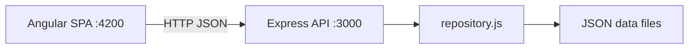

<div dir="rtl">

# FinDash - אפליקציית הדגמה

דשבורד לניהול חשבונות ותנועות פיננסיות. אפליקציה זו משמשת כ"אפליקציה האמיתית" לחקירה, תיקון באגים ופיתוח פיצ'רים בתרגיל 2 של ההדרכה.

> זהו ה-repo שהמשתתפים ישכפלו מ-GitHub לתרגיל 2.

## ארכיטקטורה

```
mock-app/
  backend/     Node.js + Express REST API (פורט 3000)
  frontend/    Angular 17 SPA (פורט 4200)
```



## הרצה מהירה

טרמינל 1 - Backend:
```bash
cd backend
npm install
npm start
```

טרמינל 2 - Frontend:
```bash
cd frontend
npm install
npm start
```

פתחו את http://localhost:4200

## פירוט
ראו `backend/README.md` ו-`frontend/README.md`.

</div>
